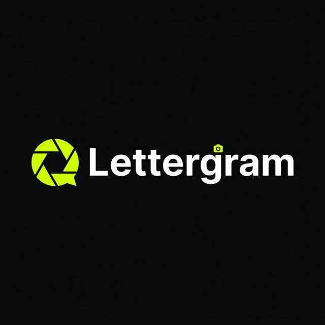
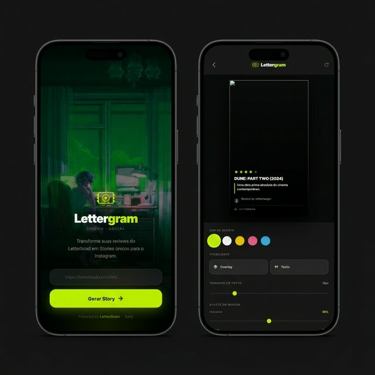

# LetterGram

**Transforme suas reviews do Letterboxd em Stories cinematográficos para o Instagram.**

`BETA` · Made with ♥ by [@wilsonwagn](https://github.com/wilsonwagn)

---

## O que é

LetterGram é uma ferramenta que combina o universo do cinema com o compartilhamento visual das redes sociais. Cole o link de qualquer review do Letterboxd, e o app gera automaticamente um Story pronto para o Instagram — com pôster, nota, trecho da review e identidade visual personalizada.

## Tecnologias

| Camada | Stack |
|---|---|
| **Frontend** | HTML · CSS · Vanilla JS · Tailwind CSS (CDN) |
| **Backend** | Python · FastAPI · BeautifulSoup4 (scraping) |
| **Deploy** | Vercel (frontend) · Uvicorn (backend local) |
| **Exportação** | `html2canvas` para geração de imagem |

## Funcionalidades

- 🎬 Extração automática de review, pôster, estrelas e perfil do Letterboxd
- 🎨 Editor visual com ajuste de imagem, zoom, overlay e cor de acento
- 📲 Exportação do Story como imagem JPG de alta resolução
- ✨ Interface mobile-first com design premium

## Status

> ⚠️ **BETA** — Projeto em desenvolvimento ativo. Funcionalidades podem mudar.
