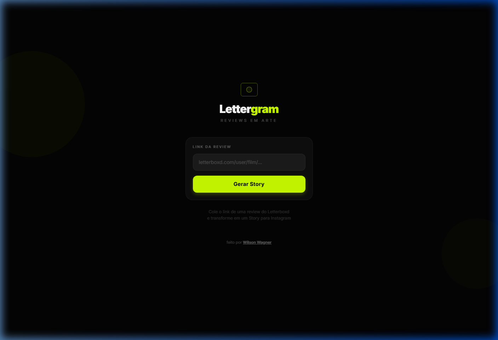

<p align="center">
  
</p>

# LetterGram

[](https://lettergram.vercel.app)
[](https://github.com/wilsonwagn/lettergram/releases/latest)
[]()

**Transforme suas reviews do Letterboxd em Stories para o Instagram.**

## O que é

LetterGram é uma ferramenta que combina o universo do cinema com o compartilhamento visual das redes sociais. Cole o link de qualquer review do Letterboxd (ex: `letterboxd.com/seuuser/film/nome-do-filme/`), e o app gera automaticamente um Story pronto para o Instagram — com pôster, nota, trecho da review e identidade visual personalizada.

## Download

| Plataforma | Link |
|------------|------|
| **Android (APK)** | [Baixar última versão](https://github.com/wilsonwagn/lettergram/releases/latest) |
| **API (Produção)** | [lettergram.vercel.app](https://lettergram.vercel.app) |

> Para instalar o APK, habilite "Fontes desconhecidas" nas configurações do Android.

## Tecnologias

| Camada             | Stack                                         |
| ------------------ | --------------------------------------------- |
| **Mobile**         | Expo 54 · React Native · TypeScript · Inter   |
| **Backend (API)**  | Python · FastAPI · BeautifulSoup4 (scraping)   |
| **Storage**        | AsyncStorage (cache local no device)           |
| **Exportação**     | `react-native-view-shot` (captura em PNG)      |
| **Deploy (API)**   | Vercel Serverless (Python)                     |

## Funcionalidades

- Extração automática de review, pôster, estrelas e perfil do Letterboxd
- Editor visual com cores de destaque personalizáveis
- Exportação do Story como imagem PNG de alta resolução
- Recap anual com estatísticas, gráfico mensal e top filmes
- Importação de CSV exportado do Letterboxd
- Interface mobile-first com design premium dark mode

## Como rodar (desenvolvimento)

### Pré-requisitos
- Python 3.10+
- Node.js 18+
- Expo Go no celular (ou emulador Android)

### Backend (API)
```bash
make setup     # Cria venv e instala deps
make backend   # Inicia API em http://localhost:8000
```

### Mobile
```bash
make install   # npm install
make app       # Expo Go (QR code)
make web       # Expo no browser
```

### Testes
```bash
make test      # pytest no backend
```

> Use `make help` para ver todos os comandos disponíveis.

---

<p align="center">
  Feito por <a href="https://github.com/wilsonwagn">Wilson Wagner</a>
</p>
